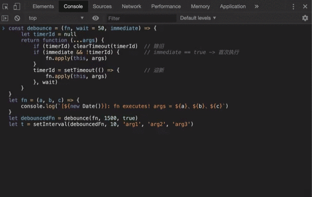
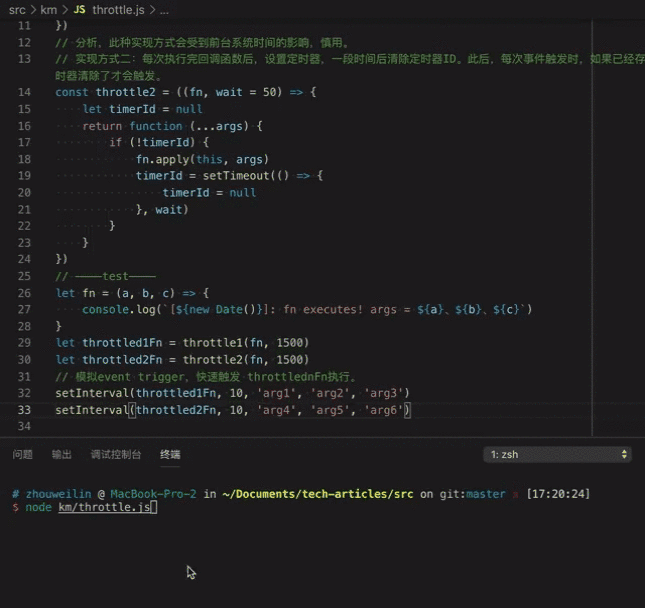
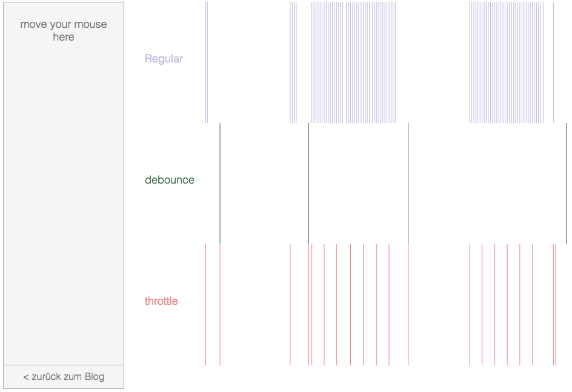

# 简洁易懂的防抖与节流科普与JavaScript实现

## 一、防抖

### 1.防抖的概念

函数防抖(debounce)是指，回调函数在一段时间内，无论触发了多少次，都只会执行最后一次。例如，我们设置了3秒等待时间，在这3秒内如果函数被再次触发，就重新计算这3秒，直到新的3秒内该函数没有再次触发，才开始执行函数。

可以结合生活中的例子来理解防抖。例如，公司的电梯门，每次有新的乘客进入电梯都会刷新等待时间，最后一名乘客进入3秒后电梯门关闭。其中，

+ 「乘客进入电梯」是频繁触发的用户事件
+ 「3秒」是用户事件触发和回调函数执行之间的等待时间
+ 「电梯关门」是事件触发后要执行的回调函数

函数防抖的本质是延迟执行。前端开发中，适合的场景包括，resize事件触发页面重绘，Google搜索输入时触发’搜索推荐‘，[跟踪鼠标事件的小鸟](https://code.h5jun.com/wik/3/edit?js,output)等等，加入防抖后，避免频繁更新DOM或频繁触发不必要的后端请求，提高了页面性能。

### 2.防抖的实现

`debounce`函数的实现需要利用高阶函数，传入回调函数`fn`和等待时间间隔`wait`,返回具有「防抖效果」的新回调函数。

防抖有两个过程，即「辞旧」和「迎新」。「辞旧」即清除掉旧定时器，「迎新」即刷新定时器，添加新的延迟执行函数。

```javascript
const debounce = (fn, wait = 50) => {
    let timerId = null
    return function (...args) {
        if (timerId) clearTimeout(timerId)  // 辞旧
        timerId = setTimeout(() => {        // 迎新
            fn.apply(this, args)
        }, wait)
    }
}
```

实际情形中，用户事件可能一直频繁触发，且每次触发间隔都小于定时器时间，导致回调函数永远无法得到执行。为了保证回调函数一定能被执行，解决方案为，通常会传入一个`immediate`的布尔变量，当`immediate`为`true`时，用户事件第一次触发时，回调函数会执行。其实现如下：

```javascript
const debounce = (fn, wait = 50, immediate) => {
    let timerId = null
    return function (...args) {
        if (timerId) clearTimeout(timerId)  // 辞旧
        if (immediate && !timerId) {        // immediate == true -> 首次执行
            fn.apply(this, args)
        }
        timerId = setTimeout(() => {        // 迎新
            fn.apply(this, args)
        }, wait)
    }
}
```

### 3.测试一下

使用如下代码，在浏览器控制台中测试防抖函数。

```javascript
// 函数防抖测测试代码
const debounce = (fn, wait = 50, immediate) => {
    let timerId = null
    return function (...args) {
        if (timerId) clearTimeout(timerId)  // 辞旧
        if (immediate && !timerId) {        // immediate == true -> 首次执行
            fn.apply(this, args)
        }
        timerId = setTimeout(() => {        // 迎新
            fn.apply(this, args)
        }, wait)
    }
}
let fn = (a, b, c) => {
    console.log(`[${new Date()}]: fn executes! args = ${a}、${b}、${c}`)
}
let debouncedFn = debounce(fn, 1500, true)
// 模拟频繁触发的用户事件
let t = setInterval(debouncedFn, 10, 'arg1', 'arg2', 'arg3')

// 在chrome控制台晚一点再粘贴执行
clearInterval(t)
```

如代码第14~16行所示，防抖前的函数会立即打印当前时间戳和传入的三个参数。如代码第17行所示，防抖处理后，延迟时间设置为1500毫秒，并设置第一次会立即执行。如代码第19行所示，利用`setInterval()`函数模拟，每10毫秒触发一次`debouncedFn()`函数，其中，定时器函数的第3~5个参数是回调函数`debounceFn()`的三个传入参数。由于防抖的原因，回调函数会一直被推迟执行。一段时间后，我们主动执行`clearInterval()`清除定时器，1500毫秒后，函数得到执行。

**测试效果**



可以看到，如预期一致。设置`immediate`可以使用户事件第一次触发时，回调函数立即执行。之后由于每隔10ms就会触发一次用户事件，导致回调函数一直无法执行。清除定时器后，1500ms后，回调函数得到执行。

## 二、节流

### 1.节流的概念

函数节流(throttle)是指，回调函数在一段时间内最多只会执行一次。在这段等待时间内，会无视新产生的函数执行请求，这段时间结束后，才会重新开始接受该回调函数的新执行请求。

可以结合生活中的例子来理解防抖。例如，关小的水阀，水龙头每隔3秒滴下一滴水，

+ 「管道中的水」是频繁触发的用户事件
+ 「水龙头」是节流阀，用于控制水的流速，即我们要实现的节流函数
+ 「一颗水滴」是回调函数被执行一次
+ 「3秒」是时间间隔，3秒内至多滴下一滴水

函数节流的本质是降低回调函数的执行频率，适合及时需要给用户反馈的交互场景，例如，用户滚动页面触发scroll事件，刷新页面内容；用户点击页面按钮秒杀商品；[节流按钮](https://code.h5jun.com/gale/1/edit?js,output)等等。

### 2.节流的实现方式（一）

第一种实现方式是，利用系统时间，来判断上一次执行距离当前时间是否大于最小等待时间。

如果达到最小等待时间，则执行，并更新上次执行的时间戳记录；否则忽略此次执行。

```javascript
// 使用系统时间来计算距离上一次执行的时间，决定执行 or 忽略
const throttle1 = ((fn, wait = 50) => {
    let previous = 0           // 上次执行的时间
    return function (...args) {
        let now = +new Date()  // 当前的系统时间
        if (now - previous > wait) {
            previous = now
            fn.apply(this, args)
        }
    }
})
```

这种实现方式简单易懂，但是会受到前台系统时间的影响，需要慎用。我将在测试部分说明这一影响。

### 3.节流的实现方式（二）

第二种方法是，使用定时器`setTimeout`。

具体实现过程为，闭包内先声明一个变量，作为定时器id，并初始化为空。返回的节流后的函数为，判断定时器ID是否为空，若为空，则执行一次回调函数，并设置定时器在时间间隔`wait`后执行回调函数；如果发现定时器已设定好，则忽略这段时间的回调函数执行请求。

```javascript
// 每次执行完回调函数后，设置定时器，一段时间后清除定时器ID。此后，每次事件触发时，如果已经存在定时器，则不触发，定时器清除了才会触发。
const throttle2 = ((fn, wait = 50) => {
    let timerId = null
    return function (...args) {
        if (!timerId) {
            fn.apply(this, args)
            timerId = setTimeout(() => {
                timerId = null
            }, wait)
        }
    }
})
```

### 4.测试

我们通过nodejs运行如下测试代码比较两种实现方式，

```javascript
// 函数节流的测试代码
// 实现方式一：使用时间戳来判断距离上一次执行的时间
const throttle1 = ((fn, wait = 50) => {
    let previous = 0
    return function (...args) {
        let now = +new Date()
        if (now - previous > wait) {
            previous = now
            fn.apply(this, args)
        }
    }
})
// 分析，此种实现方式会受到前台系统时间的影响，慎用。
// 实现方式二：每次执行完回调函数后，设置定时器，一段时间后清除定时器ID。此后，每次事件触发时，如果已经存在定时器，则不触发，定时器清除了才会触发。
const throttle2 = ((fn, wait = 50) => {
    let timerId = null
    return function (...args) {
        if (!timerId) {
            fn.apply(this, args)
            timerId = setTimeout(() => {
                timerId = null
            }, wait)
        }
    }
})
// ————test————
let fn = (a, b, c) => {
    console.log(`[${new Date()}]: fn executes! args = ${a}、${b}、${c}`)
}
let throttled1Fn = throttle1(fn, 1500)
let throttled2Fn = throttle2(fn, 1500)
// 模拟event trigger，快速触发 throttlednFn执行。
setInterval(throttled1Fn, 10, 'arg1', 'arg2', 'arg3')
setInterval(throttled2Fn, 10, 'arg4', 'arg5', 'arg6')
```

如代码第3~12行和第15~25行所示，我们用前述两种方式实现了节流函数。

如代码第27~29行所示，我们实现了与节流函数测试保持一致，使用了相同的回调函数。

代码第30行和第31行，我们分别使用了上面两种节流函数，对fn进行了节流处理。

代码第33行和第34行，模拟了频繁触发的用户事件，每10毫秒触发一次。

我们先观察输出结果，然后通过修改系统时间来测试，两种方式是否会受到影响。

**测试结果**



运行测试代码后，我们发现10毫秒触发一次的打印输出被节流成了1500毫秒触发一次，两种实现都成功地实现了函数节流。

修改系统时间后，第一种实现方式受到了影响，第二种实现方式不被影响。我们认为，第二种实现方式更优。

## 三、总结



+ 函数防抖的本质是延迟执行，函数节流的本质是事件触发降频，上图直观地表现了二者特点
+ 函数防抖，可以通过不断清除和刷新定时器来实现
+ 函数节流有两种实现方式，第一种是通过获取系统时间来判断距离上一次执行的时间间隔，依据此决定是否执行；第二种实现方式是利用定时器，判断事件队列中是否已有此回调，没有才执行并设置定时器，否则直接忽略；第一种实现方式会受到前端系统时间的影响，第二种不会
